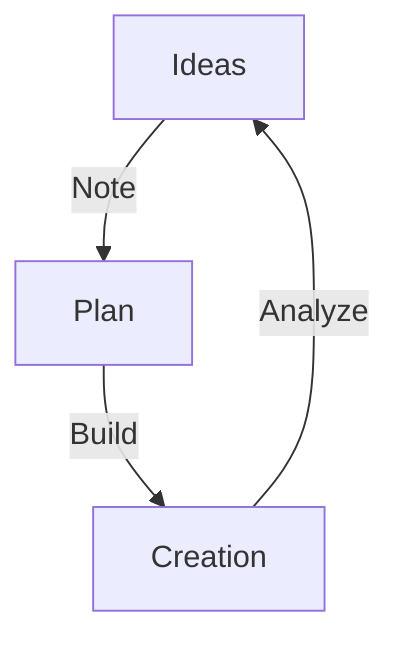

  

---

<blockquote align="center">
  <b><i>"If you hadn't made that mistake, you wouldn't have learnt the lesson it taught you."</i></b> 
  — Ayush Mazumdar
</blockquote>

---

#### 🔥 **Proficient Programmer** - Building logic
#### 💻 **Web Developer** – Bringing ideas to life
#### 🌐 **Blockchain Developer** – Creating Decentralized Applications, the Next Big Thing! 
#### 🛡 **Cyber-Security Enthusiast** – Understanding Data Safety to identify possible Vulnerable Exploits

---

## 🧠 Thought Fabric

  

