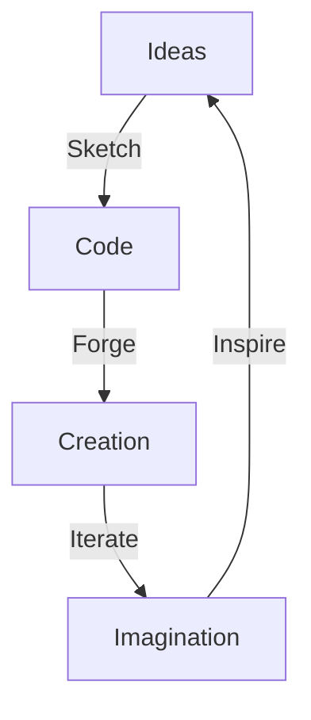

<h1 align="center">
  
</h1>

<p align="center">
  
</p>

---

<blockquote align="center">
  <b><i>"If you hadn't made that mistake, you wouldn't have learnt the lesson it taught you."</i></b><br>
  — Ayush Mazumdar
</blockquote>

---

## 👁‍🗨 Who Am I?

```txt
Ayush Mazumdar
⮞ From Dhanbad, Jharkhand, India 🇮🇳
⮞ Builder of logic, breaker of boundaries
⮞ Cyber sentry | Game weaver | Web alchemist
⮞ Obsessed with ideas that turn heads and spark minds
```
## 🧠 Thought Fabric

## ⚒️ In My Lab — Where Realities Collide

> _“Each project is a universe — forged, explored, and brought to life.”_

| 🌐 **CampusVerse**       | 🎮 **Obstacle Mania**      | 🎓 **Scholar’s Playground** | 📦 **Pokedex**            |
|-------------------------|----------------------------|-----------------------------|---------------------------|
| [Explore the campus](https://aysh-mzmdr.github.io/CampusVerse/) | [Dodge the impossible](https://aysh-mzmdr.github.io/ObstacleMania/) | [Learn & play](https://aysh-mzmdr.github.io/Scholars_Playground/) | [Catch ’em all](https://aysh-mzmdr.github.io/Pokedex/) |

✨ _Enter the labyrinth of code and creativity:_  
👉 [**aysh-mzmdr.github.io**](https://aysh-mzmdr.github.io/)

---

## 🌌 Digital Soul — The Elements I Bend

```text
╔═══════════════╦════════════════════════════════════════╗
║   LANGUAGES   ║  C++   ·   Python   ·   JavaScript      ║
║               ║  Solidity   ·   C#                      ║
╠═══════════════╬════════════════════════════════════════╣
║ FRAMEWORKS &  ║  React   ·   Node.js   ·   Express       ║
║ LIBRARIES     ║  Unity   ·   GSAP      ·   Three.js      ║
╠═══════════════╬════════════════════════════════════════╣
║     TOOLS     ║  Kali Linux   ·   Git   ·   PostgreSQL   ║
║               ║  Blender   ·   Figma                     ║
╠═══════════════╬════════════════════════════════════════╣
║ SOFT POWERS   ║  Tenacity   ·   Vision   ·   Curiosity   ║
╚═══════════════╩════════════════════════════════════════╝
```
## 🗝️ Philosophy — The Code That Guides Me
🚫 Templates bore me.
🚀 I build for awe.
🔍 I observe before I disrupt.
🔥 If it doesn’t spark wonder, it isn’t done.

## 🌀 Connect or Collide — Choose Your Path
```
╔════════════════════════════════════════════════════════════════╗
║                     ⚡ Reach out & connect ⚡                    ║
╠════════════════════════════════════════════════════════════════╣
║ ✉️  Email     │  [ayush.mazumdar111@gmail.com](mailto:ayush.mazumdar111@gmail.com)               ║
║ 🌐 Portfolio │  [aysh-mzmdr.github.io](https://aysh-mzmdr.github.io)                           ║
║ 💼 LinkedIn  │  [linkedin.com/in/ayush-mazumdar-3735b731b](https://www.linkedin.com/in/ayush-mazumdar-3735b731b/) ║
║ 👾 GitHub    │  [github.com/aysh-mzmdr](https://github.com/aysh-mzmdr)                            ║
╚════════════════════════════════════════════════════════════════╝
```
<details> <summary>✨ Pro Tip: Hover over the links — and let the digital magic begin ✨</summary>
Every click is a portal. Every visit, a spark. Your journey starts here.

</details>


<p align="center">  </p>
