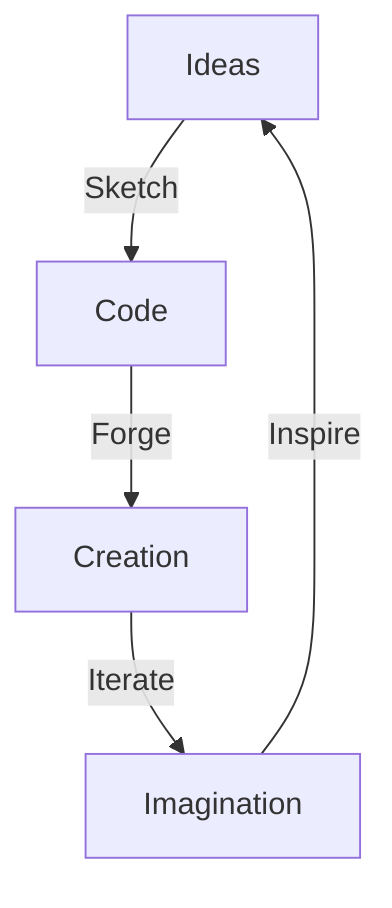

<h1 align="center">
  
</h1>

<p align="center">
  
</p>

---

<blockquote align="center">
  <b><i>"If you hadn't made that mistake, you wouldn't have learnt the lesson it taught you."</i></b><br>
  — Ayush Mazumdar
</blockquote>

---

## 👁‍🗨 Who Am I?

```txt
Ayush Mazumdar
⮞ From Dhanbad, Jharkhand, India 🇮🇳
⮞ Builder of logic, breaker of boundaries
⮞ Cyber sentry | Game weaver | Web alchemist
⮞ Obsessed with ideas that turn heads and spark minds
```
🧠 Thought Fabric

⚒️ In My Lab
🌐 CampusVerse

🎮 Obstacle Mania

🎓 Scholar’s Playground

📦 Pokedex

Each a different reality. Each a new experiment.
Dive into the mind behind the machine: aysh-mzmdr.github.io

🌌 Digital Soul
Languages:
C++, Python, JavaScript, Solidity, C#

Frameworks:
React, Node.js, Express, Unity, GSAP, 3js

Tools:
Kali Linux, Git, PostgreSQL, Blender, Figma

Soft Powers:
Tenacity, Vision, Curiosity

🗝️ Philosophy
🚫 Templates bore me.

🚀 I build for awe.

🔍 I observe before I disrupt.

🔥 If it doesn’t spark wonder, it isn’t done.

🌀 Connect or Collide
You’re either creating the storm or watching it pass.

✉️ ayush.mazumdar111@gmail.com

🌐 Portfolio

💼 LinkedIn

👾 GitHub

<p align="center">  </p>
