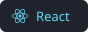
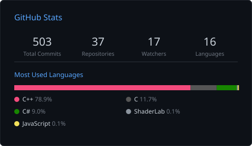
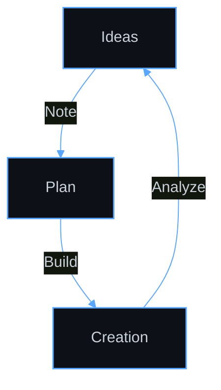

  

<blockquote align="center">
  <b><i>"If you hadn't made that mistake, you wouldn't have learnt the lesson it taught you."</i></b> 
  — Ayush Mazumdar
</blockquote>

## Tech Stack

 

  
  
  
  

 

  
  
  

  
  
  
  
  

  
  
  
  

## GitHub Stats

  

  

## Thought Fabric

```mermaid
%%{init: {'theme': 'base', 'themeVariables': {'background': '#0d1117', 'primaryColor': '#0d1117', 'primaryBorderColor': '#58a6ff', 'primaryTextColor': '#c9d1d9', 'lineColor': '#58a6ff'}, 'flowchart': {'padding': 20, 'nodeSpacing': 60, 'rankSpacing': 70}}}%%
graph TD;
    Ideas -->|Note| Plan;
    Plan -->|Build| Creation;
    Creation -->|Analyze| Ideas;

    style Ideas fill:#0d1117,stroke:#58a6ff,stroke-width:1.5px,color:#c9d1d9
    style Plan fill:#0d1117,stroke:#58a6ff,stroke-width:1.5px,color:#c9d1d9
    style Creation fill:#0d1117,stroke:#58a6ff,stroke-width:1.5px,color:#c9d1d9

    linkStyle 0 stroke:#58a6ff,stroke-width:1px
    linkStyle 1 stroke:#58a6ff,stroke-width:1px
    linkStyle 2 stroke:#58a6ff,stroke-width:1px
```

## Connect

  
  
  

## Total Public Views

  
  &nbsp;&nbsp;&nbsp;&nbsp;
  

  

