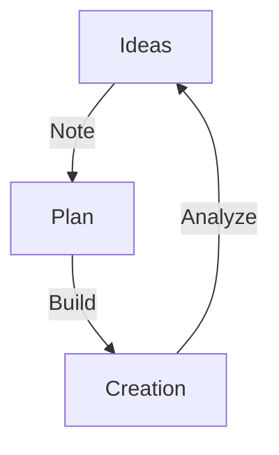

  

  

<blockquote align="center">
  <b><i>"If you hadn't made that mistake, you wouldn't have learnt the lesson it taught you."</i></b> 
  — Ayush Mazumdar
</blockquote>

  
  
  
  

  

## Tech Stack

    
  
  
  
  
  

    
  
  
  
  

    
  
  
  

  

## GitHub Stats

  
  

  

  

  

## Thought Fabric

```mermaid
graph TD;
    Ideas -->|Note| Plan;
    Plan -->|Build| Creation;
    Creation -->|Analyze| Ideas;
```

  

## Connect

  
  
  

  

